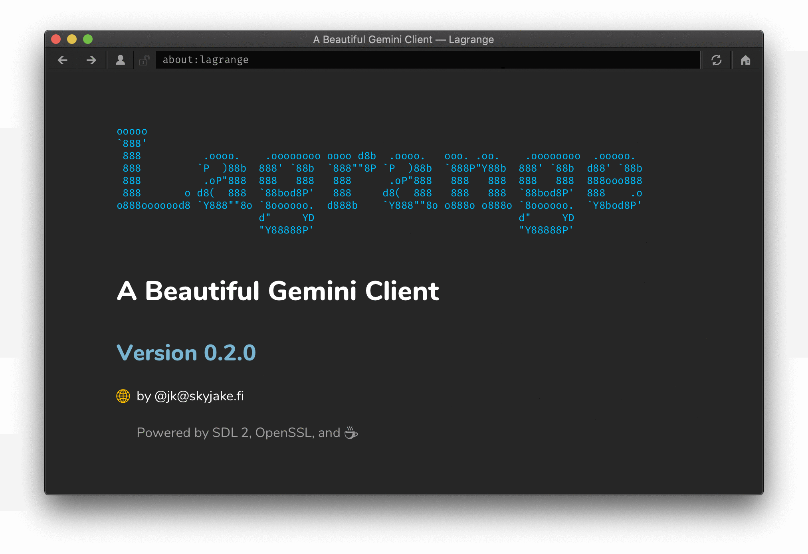

# Lagrange

Lagrange is a desktop GUI client for browsing [Geminispace](https://gemini.circumlunar.space/). It offers modern conveniences familiar from web browsers, such as smooth scrolling, inline image viewing, multiple tabs, visual themes, Unicode fonts, bookmarks, history, and page outlines.

Like Gemini, Lagrange has been designed with minimalism in mind. It depends on a small number of essential libraries. It is written in C and uses [SDL](https://libsdl.org/) for hardware-accelerated graphics. [OpenSSL](https://openssl.org/) is used for secure communications.



## Features

* Beautiful typography with full Unicode support
* Autogenerated page style and symbol for each Gemini domain
* Smart suggestions when typing the URL — search bookmarks, history, identities
* Sidebar for page outline, managing bookmarks and identities, and viewing history
* Multiple tabs
* Identity management — create and use TLS client certificates
* Audio playback: MP3, Ogg Vorbis, WAV
* And much more! Open `about:help` in the app, or see [help.gmi](https://git.skyjake.fi/gemini/lagrange/raw/branch/release/res/about/help.gmi)

## Downloads

Prebuilt binaries for Windows, macOS (10.13 or later) and Linux can be found in [Releases][rel]. You can also find [Lagrange on Flathub for Linux](https://flathub.org/apps/details/fi.skyjake.Lagrange).

On macOS you can install and upgrade via Homebrew:

    brew install --cask lagrange

Please check [MacPorts](https://ports.macports.org/port/lagrange/) if you are using macOS 10.12 or older.

On Fedora and any RHEL/CentOS Stream 8 and 9 derivatives (RHEL, CentOS Stream, Alma, Rocky) that have the EPEL repos enabled:

    sudo dnf install lagrange

On openSUSE Tumbleweed:

    sudo zypper install lagrange

Using GNU Guix:

    guix install lagrange

## How to compile

You need a POSIX-compatible environment to compile Lagrange.

The required tools are a C11 compiler (e.g., Clang or GCC), CMake, `pkg-config`, and `zip`. Additional tools are required if HarfBuzz and GNU FriBidi are also compiled as part of the build (see next section for details).

1. Download and extract a source tarball from [Releases][rel]. Please note that the GitHub/Gitea-generated tarballs do not contain HarfBuzz, GNU FriBidi, or [the_Foundation](https://git.skyjake.fi/skyjake/the_Foundation) submodules; check which tarball you are downloading. Alternatively, you may also clone the repository and its submodules: `git clone --recursive --branch release https://git.skyjake.fi/gemini/lagrange`
2. Check that you have the recommended build tools and dependencies installed: SDL 2, OpenSSL 1.1.1, libpcre, libunistring, GNU FriBidi, and zlib. For example, on macOS this would do the trick (using Homebrew): ```brew install cmake sdl2 openssl@1.1 pcre libunistring fribidi``` Or on Ubuntu: ```sudo apt install cmake zip libsdl2-dev libssl-dev libpcre3-dev zlib1g-dev libunistring-dev libfribidi-dev```
3. Optionally, install the mpg123 decoder library for MPEG audio support. For example, the macOS Homebrew package is `mpg123` and on Ubuntu it is `libmpg123-dev`.
4. Create a build directory.
5. In your empty build directory, run CMake: ```cmake {path_of_lagrange_sources} -DCMAKE_BUILD_TYPE=Release```
6. Build it: ```cmake --build .```
7. Now you can run *lagrange*, *lagrange.exe*, or *Lagrange.app*.

### Unicode text rendering

Lagrange relies on the [HarfBuzz](https://harfbuzz.github.io) and [GNU FriBidi](https://github.com/fribidi/fribidi/) libraries for handling complex scripts and bidirectional text. This repository includes these two libraries as submodules. By default, if HarfBuzz and GNU FriBidi are not available on the system, they will be compiled as part of the app without any additional dependencies.

Note that compiling these libraries has the following requirements:

* HarfBuzz requires a C++ compiler.
* GNU FriBidi cannot be compiled with CMake; you need to have [Meson](https://mesonbuild.com) and [Ninja](https://ninja-build.org).

If these requirements cannot be met, or you would prefer the use the system-provided HarfBuzz and GNU FriBidi, please refer to the list of build options below: `ENABLE_HARFBUZZ_MINIMAL` and `ENABLE_FRIBIDI_BUILD` should both be set to **NO**. Note that a system-provided HarfBuzz likely has dependencies to other libraries, such as FreeType and GLib.

You also may disable HarfBuzz and/or GNU FriBidi entirely. The old text renderer that only supports non-complex left-to-right scripts is then used.

### Installing to a custom directory

By default, the compiled app will be installed to a system-wide location determined by CMake.

Set `CMAKE_INSTALL_PREFIX` to install to a directory of your choosing:

1. `cmake {path_of_lagrange_sources} -DCMAKE_BUILD_TYPE=Release -DCMAKE_INSTALL_PREFIX=/dest/path`
2. `cmake --build . --target install`

Note that the `install` target also deploys an XDG .desktop file for launching the app.

### Build options

| CMake Option | Description |
| ------------ | ----------- |
| `ENABLE_CUSTOM_FRAME` | Draw a custom window frame. (Only on Microsoft Windows.) The custom frame is more in line with the visual style of the rest of the UI, but does not implement all of the native window behaviors (e.g., snapping, system menu). |
| `ENABLE_DOWNLOAD_EDIT` | Allow changing the Downloads directory via the Preferences dialog. This should be set to **OFF** in sandboxed environments where  downloaded files must be saved into a specific place. |
| `ENABLE_IDLE_SLEEP` | Sleep in the main thread instead of waiting for events. On some platforms, when using SDL 2.0.16 or earlier, `SDL_WaitEvent()` may have a relatively high CPU usage. Setting this to **ON** polls for events periodically but otherwise keeps the main thread sleeping, reducing CPU usage. The drawback is that there is a slightly increased latency reacting to new events after idle mode ends. |
| `ENABLE_FRIBIDI` | Use the GNU FriBidi library for processing bidirectional text. FriBidi implements the Unicode Bidirectional Algorithm to determine text directions. |
| `ENABLE_FRIBIDI_BUILD` | Compile the GNU FriBidi library as part of the build. If set to **OFF**, `pkg-config` is used instead to locate the library. |
| `ENABLE_HARFBUZZ` | Use the HarfBuzz library for shaping Unicode text. This is required for correctly rendering complex scripts and combining glyphs. If disabled, a simplified text shaping algorithm is used that only works for non-complex languages like English. |
| `ENABLE_HARFBUZZ_MINIMAL` | Build the HarfBuzz library with all dependencies disabled. Useful when building the app for distribution so that the number of deployed dependencies will be minimized. A system-provided version of HarfBuzz is likely built with dependencies on FreeType and ICU at least. If set to **OFF**, `pkg-config` will be used to find HarfBuzz. | 
| `ENABLE_IPC` | Instances of the Lagrange executable communicate via signals or (on Windows) a system-provided IPC mechanism. This is used for controlling an existing Lagrange window via the CLI. If set to **OFF**, each instance of the app runs without knowledge of other instances. This may cause them to overwrite each other's runtime files. |
| `ENABLE_KERNING` | Use kerning information in the fonts to adjust glyph placement. Setting this **ON** improves text appearance in subtle ways but slows down text rendering. It may be a good idea to set this to **OFF** when running on a slow CPU. This option only affects the simple built-in text renderer, and has no effect on HarfBuzz. |
| `ENABLE_MPG123` | Use the mpg123 library for decoding MPEG audio files. |
| `ENABLE_RELATIVE_EMBED` | Locate resources only in relation to the executable. Useful when any system/predefined directories are not supposed to be accessed, e.g., in the Windows portable build. |
| `ENABLE_RESOURCE_EMBED` | Embed all resource files into the Lagrange executable instead of keeping them in a separate file that gets loaded at launch. Setting this **ON** makes it much slower to run CMake and to compile Lagrange. |
| `ENABLE_TUI` | Build the TUI version (`clagrange`). The SEALCurses library is required: it is used instead of SDL. |
| `ENABLE_WEBP` | Use libwebp to decode .webp images, if `pkg-config` can find the library. |
| `ENABLE_WINDOWPOS_FIX` | Set correct window position after the window has already been shown. This may be necessary on some platforms to prevent the window from being restored to the wrong position. |
| `ENABLE_X11_SWRENDER` | Default to software rendering when running under X11. By default Lagrange attempts to use the GPU for rendering the user interface. You can also use the `--sw` option at launch to force software rendering. |

### Compiling the TUI version

Lagrange has an optional text-mode interface that enables running the app in the terminal. This is disabled by the default build settings. Setting the `ENABLE_TUI` option to `YES` will replace the SDL dependency with a library called [SEALCurses](https://git.skyjake.fi/skyjake/sealcurses.git) that implements the required parts of the SDL API on top of Curses. The resulting executable is called `clagrange`.

The requirements for building the TUI version are the same as with the GUI, except [ncurses](https://invisible-island.net/ncurses/) is required instead of SDL. HarfBuzz and all the image and audio dependencies are excluded from the TUI build.

The `build-tui.sh` helper script is provided for building the TUI version. All command line arguments given to the script are passed to CMake for further configuring the build. Note that the CMake install prefix variable (`CMAKE_INSTALL_PREFIX`) should not be set via an argument. Instead, the script will prompt for the install directory when run.

### Compiling on macOS

When using OpenSSL 1.1.1 from Homebrew, you must add its pkgconfig path to your `PKG_CONFIG_PATH` environment variable, for example:

    export PKG_CONFIG_PATH=/opt/homebrew/Cellar/openssl@1.1/1.1.1i/lib/pkgconfig

Also, SDL's trackpad scrolling behavior on macOS is not optimal for regular GUI apps because it emulates a physical mouse wheel. This may change in a future release of SDL, but at least in 2.0.14 (and earlier) a [small patch](https://git.skyjake.fi/gemini/lagrange/raw/branch/dev/sdl2-macos-ios.diff) is required to allow momentum scrolling to come through as single-pixel mouse wheel events. Note that SDL comes with an Xcode project; use the "Shared Library" target and check that you are doing a Release build.

### Compiling on Windows

Windows builds require [MSYS2](https://www.msys2.org). In theory, [Clang](https://clang.llvm.org/docs/MSVCCompatibility.html) or GCC (on [MinGW](http://mingw.org)) could be set up natively on Windows for compiling everything, but the_Foundation still lacks Win32 implementations for the Socket and Process classes and these are required by Lagrange. [Cygwin](http://cygwin.org) is a possible alternative to MSYS2, although Cygwin builds have not been tested.

You should use a version of the SDL 2 library that is compiled for native Windows (i.e., the MSVC variant) instead of the version from MSYS2 or MinGW. You can download a copy of the SDL binaries from [libsdl.org](https://libsdl.org/). To make configuration easier in your MSYS2 environment, consider writing a custom sdl2.pc file so `pkg-config` can automatically find the correct version of SDL. Below is an example of what your sdl2.pc might look like:

    prefix=/c/SDK/SDL2-2.0.12/
    arch=x64
    libdir=${prefix}/lib/${arch}/
    incdir=${prefix}/include/
    
    Name: sdl2
    Description: Simple DirectMedia Layer
    Version: 2.0.12-msvc
    Libs: ${libdir}/SDL2.dll -mwindows
    Cflags: -I${incdir}

The `-mwindows` option is particularly important as that specifies the target is a GUI application. Also note that you are linking directly against the Windows DLL — do not use any prebuilt .lib files if available, as those as specific to MSVC.

`pkg-config` will find your .pc file if it is on `PKG_CONFIG_PATH` or you place it in a system-wide pkgconfig directory.

Once you have compiled a working binary under MSYS2, there is still an additional step required to allow running it directly from the Windows shell: the shared libraries from MSYS2 must be found either via `PATH` or by copying them to the same directory where _lagrange.exe_ is located.

### Compiling on Raspberry Pi

On Raspberry Pi 4/400, you can compile and run Lagrange just like on a regular desktop PC. Accelerated OpenGL graphics should work fine under X11.

On Raspberry Pi 3 or earlier, you should use a version of SDL that is compiled to take advantage of the Broadcom VideoCore OpenGL ES hardware. This provides the best performance when running Lagrange in a console. OpenGL under X11 on Raspberry Pi 2/3 is quite slow/experimental. When running under X11, software rendering is the best choice and the SDL from Raspbian etc. is sufficient.

The following build options are recommended on Raspberry Pi 2/3:

* `ENABLE_KERNING=NO`: faster text rendering without noticeable loss of quality
* `ENABLE_WINDOWPOS_FIX=YES`: workaround for window position restore issues (SDL bug)
* `ENABLE_X11_SWRENDER=YES`: use software rendering under X11

[rel]: https://git.skyjake.fi/gemini/lagrange/releases
[tf]:  https://git.skyjake.fi/skyjake/the_Foundation

### Compiling on iOS

Compiling Lagrange on iOS is moderately difficult.

As a prerequisite, you will need to have an [iOS toolchain configuration for CMake](https://github.com/leetal/ios-cmake). CMake is required for Lagrange itself and for the\_Foundation. You will also need [Autotools helpers for iOS](https://github.com/szanni/ios-autotools.git) because HarfBuzz, libiconv, libunistring, and libpcre use Automake. Meson and Ninja are used for GNU FriBidi. The _iconfigure_ script in the Autotools helpers needs to be [patched](ios/iconfigure-osminver.patch).

After these utilities are available, the scripts in _ios/_ can be used as a basis for the build. Unfortunately there is no ready-made high-level script for performing all these steps, so you'll need to adapt them individually to your needs.

1. Meson cross-compilation is controlled with _ios/cross-mac-arm64-ios-arm64.ini_. Modify it to be compatible with your build system and target device.
2. _ios/deps.sh_ compiles most of the dependencies using Meson, Ninja, and _iconfigure_. Note that the simulator build has not been set up in these scripts, only the `os` build.
3. Clone [OpenSSL for iPhone](https://github.com/x2on/OpenSSL-for-iPhone.git) and build it with iOS 9.0 as the minimum version. Deploy the static libraries in *$HOME/SDK/ios/$arch/*, or wherever you've set `IOS_DIR` to be.
4. Create an empty build directory for the\_Foundation and run _ios/cmake-ios-tf.sh_ from there. You may need to adjust the source directory path in the script depending on where you place your build directory.
5. Now you can `make install` to build and deploy the_Foundation to `IOS_DIR`.
6. Finally, you can run CMake like in _ios/cmake-ios-lagrange.sh_ to generate an Xcode project that builds the app.

If FriBidi and HarfBuzz are not used (disabling RTL and complex text rendering), the first step can be skipped and the corresponding build steps in _ios/deps.sh_ can be removed. In this case, Meson and Ninja are not needed at all.

## User files

On Windows, user files are stored in *%HOMEPATH%/AppData/Roaming/fi.skyjake.Lagrange/*, unless one is using the portable distribution and there is a *userdata/* subdirectory present in the executable directory.

On macOS, user files are stored in *~/Library/Application Support/fi.skyjake.Lagrange/*.

On Linux/*BSD/other operating systems, user files stored in _~/.config/lagrange/_ unless you have customized the XDG directories, in which case the `XDG_CONFIG_HOME` environment variable is used to determine where user files saved.

The usage and contents of the user files are described in the Help document. You can delete one or more of the files while Lagrange is not running to reset the corresponding data to the default/empty state.

One instance of Lagrange can be running at a time per user directory.
